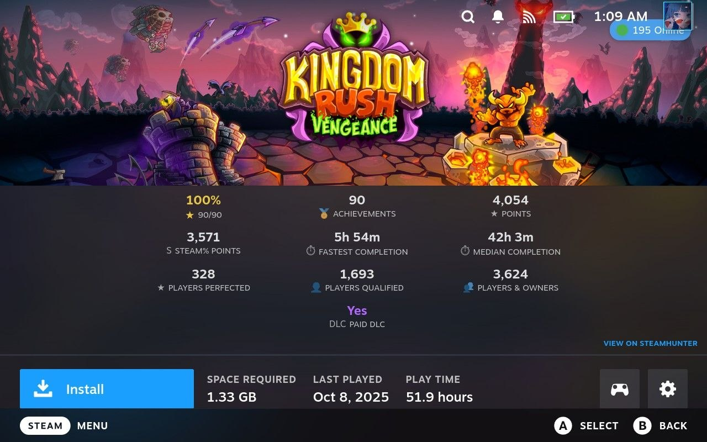

# steam-hunter-for-deck

A [Decky Loader](https://github.com/SteamDeckHomebrew/decky-loader) plugin that shows [SteamHunter](https://steamhunters.com) summary stats on Steam library game pages (`/library/app/:appid`).

No SteamHunter account is required for global stats. Your own achievement progress comes from the Steam client on the Deck.

## Features

### Game stats overlay

On any library game page with achievements, a stats panel appears above the usual game details:

| | | |
|---|---|---|
| **Your progress** | Achievements | Points |
| **Steam% Points** | Fastest completion | Median completion |
| **Players perfected** | Players qualified | Players & owners |
| | **Paid DLC** (if applicable) | |

- **Your progress** — unlocked count and percentage from `SteamClient.Apps.GetMyAchievementsForApp` (gold styling at 100%).
- **SteamHunter stats** — fetched from `https://steamhunters.com/api/apps/{appId}` (and achievements endpoint for Steam% points sum).
- **Paid DLC** — shown only when the API reports paid DLC; displayed as **Yes** in bold purple.
- **Games without achievements** — only **Players & owners** is shown.
- **View on SteamHunter** — footer link opens the full achievements page in the system browser.



### Quick Access menu

Open the plugin from the Decky menu (⋯) to clear cached stats. Data is stored locally for **12 hours** before refetching.

## Data & privacy

- Stats are read from the public SteamHunter API via `fetchNoCors` (frontend only).
- Cache: in-memory per session plus `localforage` on device (12h TTL).
- No credentials or SteamHunter login are used by this plugin.

## Install

Install through the Decky Plugin Store (not listed yet) or sideload a release zip built from this repo.

Requires [Decky Loader](https://github.com/SteamDeckHomebrew/decky-loader).

## Development

### Requirements

- Node.js 16.14+
- [pnpm](https://pnpm.io/) v9 (`npm i -g pnpm@9`)
- Optional: VS Code / VSCodium with the repo’s `.vscode` tasks (`setup`, `build`, `deploy`)

### Build

```bash
pnpm install
pnpm run build
```

Output goes to `dist/`. After changing frontend code, rebuild before deploying to the Deck.

Update UI dependencies if needed:

```bash
pnpm update @decky/ui --latest
```

### Deploy to Steam Deck

Use the VS Code **deploy** task, or copy the built plugin folder to the Deck’s Decky plugins directory. A local `deploy.sh` (gitignored) can wrap your SSH/rsync workflow.

### Project layout

```
src/
  index.tsx              # Plugin entry, library patch lifecycle
  patches/libraryApp.tsx # Splices GameStats onto /library/app/:appid
  components/
    GameStats/           # 3×3 (+ optional paid DLC row) stats grid
    QuickAccessView/     # Clear cache button
  hooks/
    useSteamHunter.ts    # SteamHunter API + cache
    useSteamAchievements.ts
    cache.ts
main.py                  # Minimal Python backend (lifecycle only)
```

Plugin id in `plugin.json`: **steam-hunter-for-deck**.

### Plugin store / distribution

See the [Decky plugin development wiki](https://wiki.deckbrew.xyz/en/user-guide/home#plugin-development) and [decky-plugin-database](https://github.com/SteamDeckHomebrew/decky-plugin-database) for submission and zip layout requirements.

## Credits

- Stats and branding: [SteamHunter](https://steamhunters.com)
- Built with [@decky/ui](https://github.com/SteamDeckHomebrew/decky-frontend-lib) and [@decky/api](https://github.com/SteamDeckHomebrew/decky-loader)
- Inspired by [hltb-for-deck](https://github.com/SteamDeckHomebrew/hltb-for-deck) (library page overlay pattern)

## License

BSD-3-Clause — see [LICENSE](LICENSE).
